# 欢迎使用Ye_ShaderToy（建议使用VS Code浏览MarkDown）
## 简单介绍
1. Ye_ShaderToy是一个基于**YEGE制作**的多媒体引擎*EasyVisualEngine*制作的一个渲染程序，它与网站版本的ShaderToy一样，通过编辑一个片段着色器文件以及加载一些贴图到Channel中，实现精美的2D或者3D图形绘制！语言都是使用glsl和统一变量名都是一样的！
2. 制作本程序的目的是可以让我们编辑好的片段着色器程序可以不依赖ShaderToy网站，在本地电脑中渲染(主要是每次进网站都要等一个傻傻的人机检测，有时还卡住了)，同时您还可以将写好的片段着色器后把整个项目复制出来分享。如果您的电脑***有独立显卡***的话，会直接使用独立显卡进行渲染，从而获得更好的性能和展示效果！
3. **主程序在Application文件中，EasyVisualEngine文件请不要删除!**
## 从ShaderToy网站中摘录的着色器代码后效果展示
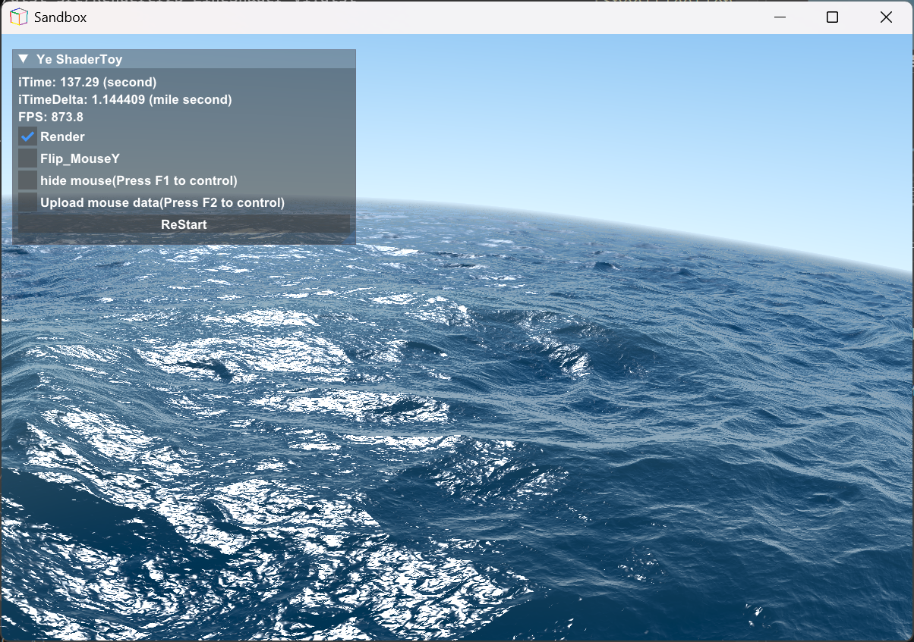  
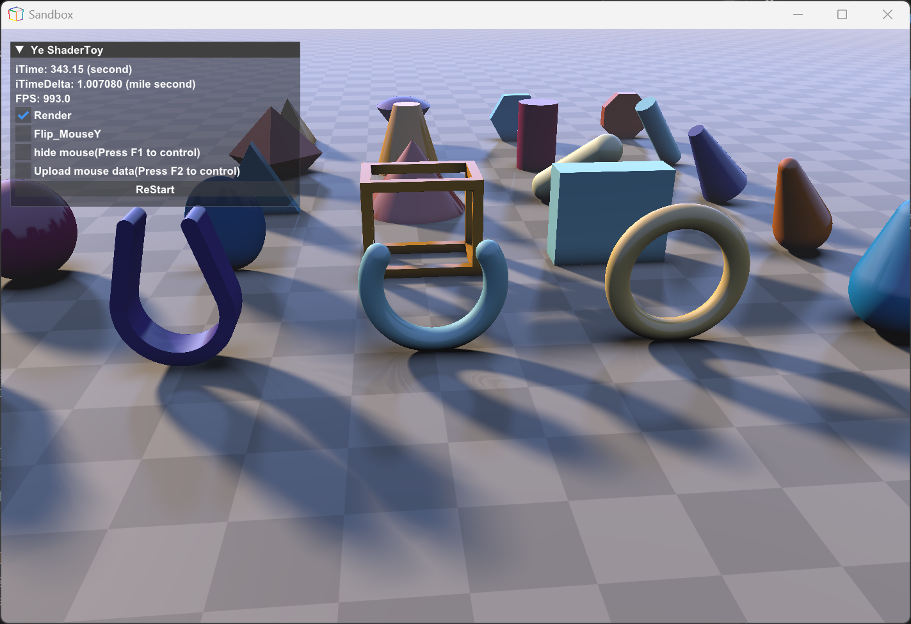  
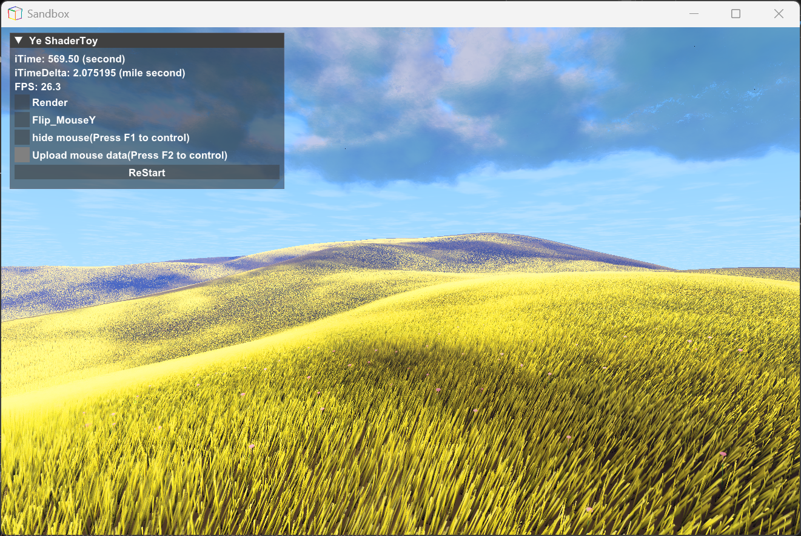  
## 细节声明
1. 由于本人只是大致根据ShaderToy的渲染管线逻辑来制作的程序(并非真正的移植)，不是很清楚ShaderToy其他的细节，而且使用的图形库也不一样，可能会导致最终图像效果和网站上展示的效果有些许不同。
2. 由于引擎的框架尚未完善，以及时间上的问题，Ye_ShaderToy暂时还*不能像网站一样把音频文件，也暂时不支持音频编辑，无法将立方贴图挂载到每一个buffer和MainImage的Channel中去*！当前每个缓冲以及单独的主图像的Channel只能挂载buffer(buffer支持自采样)和2D贴图(格式建议使用png)。
3. 关于键盘和鼠标的输入方面，鼠标的输入以及在着色器程序中的访问方式是和网站的是一样的，但是键盘的话暂时不能像网站那样子挂载到channel中去进行访问(因为本人还在想为键盘映射单独开辟一个专用的Texture贴图，直接对它进行采样检测，想要征求别人的意见)
4. 当前Ye_ShaderToy使用的是通过yaml脚本来配置每个缓冲以及采集通道，暂时不公开源码进行自定义渲染管线。如果后期需要可能会考虑公开
## yaml脚本初始化配置以及编辑指南
1. 运行Application文件中的*SandBox.exe*时，会读取SandBox.exe所在的目录中的*SettingScript.yaml*配置文件，如果配置文件不存在的话，程序会自动重新生成一份新的配置文件，在可执行程序的所在的目录，同时程序会**自动退出**。(这个操作也适用于当配置文件出现错误编辑，尤其是不知道哪里出问题时，重新生成干净的配置文件)
2. 配置文件中有4个大分支，我们先认识一下，它们的冒号后面请不要有任何的增删操作，它们分别是：***Script_Version(脚本版本号)***、***FrameBuffer_SourceCode_FilePath(帧缓冲源代码文件路径)***、***Texture_FilePath_and_Setting(贴图文件路径以及设置)***、***ChannelSetting(通道设置)***。接下来我会一一介绍这四个大分支中的内容以及编辑方式。
3. 首先是*Script_Version*：这个只是一个标记当前脚本系统的版本第一个数字是主版本，第二个数字是小版本，第三和第四个数字分别代表脚本系统修订的月份和日。参数类型只是一个*字符串*，脚本系统在读取配置文件时，**不会读取这个分支**！当然你也可以自己去自定义它的内容，**不会影响加载**！效果如图：  
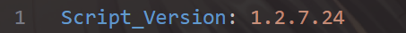  
4. 第二个是*FrameBuffer_SourceCode_FilePath*:它的内容接的是4个键值分别是：***MainImage(input FilePath)***、***Buffer_A(input FilePath, or skip)***、***Buffer_B(input FilePath, or skip)***、***Buffer_C(input FilePath, or skip)***、***Buffer_D(input FilePath, or skip)***，效果如图：  
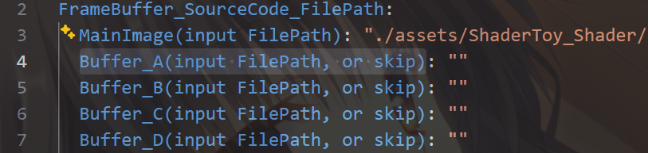  
我们在键值的冒号的右边填写着色器源文件的路径，数据类型是字符串。在填写文件路径的时候，一般是使用**相对路径**，并且是***相对于可执行文件***的路径。如果**MainImage没有设置主图像帧缓冲的着色器源文件路径(或者是路径不正确)**，程序会**自动退出**。如果**Buffer_x**没有设置帧缓冲着色器源文件路径，程序就不会创建帧缓冲。帧缓冲的渲染顺序如下：
Buffer_A->Buffer_B->Buffer_C->Buffer_D->MainImage。
*所以当我们在配置文件中给每一个帧缓冲设置路径时，一旦着色器源文件存在，帧缓冲立即创建，如果留空那就不会生成，但是MainImage必须要设置。* Buffer的填写最标准示例如下图：  
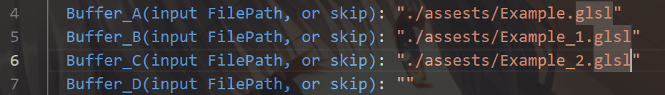  
我们创建帧缓冲的顺序是**必须从Buffer_A开始**，然后**连续的填写路径**，这样规范的*原因*是创建帧缓冲的指针是*连续紧密*的，如果不是从首个元素开始连续创建，会影响到后续帧缓冲之间通道的*链接乱序甚至是导致失败* (后期版本可能会改进)，如下图是**经典的错误示范**：  
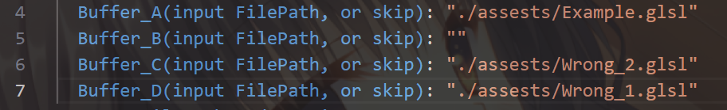  
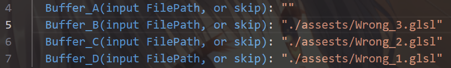  
5. 第三个是*Texture_FilePath_and_Setting*：它的内容是接一个**16个2D贴图设置**的大数组，前三个贴图整体设置如下图：  
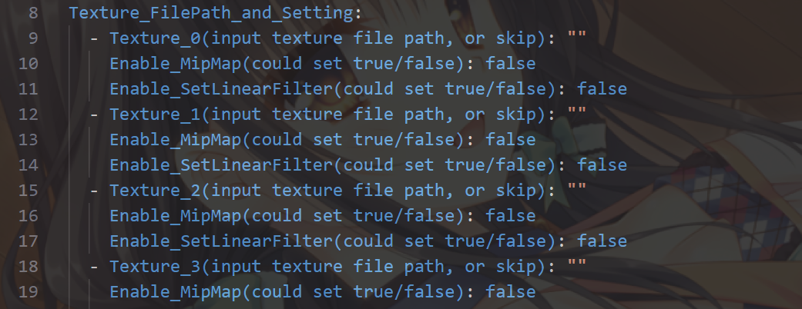  
每个-开头就是一个元素的开头，一个元素的内容如下图：  
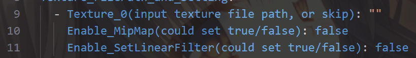  
现在我来举例Texture_0元素中的参数用途（其他的Texture也是以此类推的）：**Texture_x**后面输入的是贴图的**文件路径**，当路径存在的话，贴图将会被加载到显存中，**可以留空不设置**；**Enable_MipMap**是设置是否为该贴图**生成MipMap(缩略图)**，只能接受**布尔**参数；**Enable_SetLinearFilter**是设置贴图的过滤方式**是否是线性采样**，如果设置为*false*,过滤方式将设置为*临近采样*。现在展示一下标准的写法：  
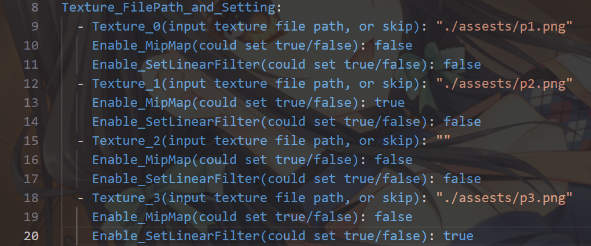  
**贴图加载和设置的过程中，不要求每个贴图的设置都连续，也不要求从Texture_0开始加载**。
6. 最后一个*ChannelSetting*：它的内容是存储每一个帧缓冲中的通道设置状况，整体情况如下图：  
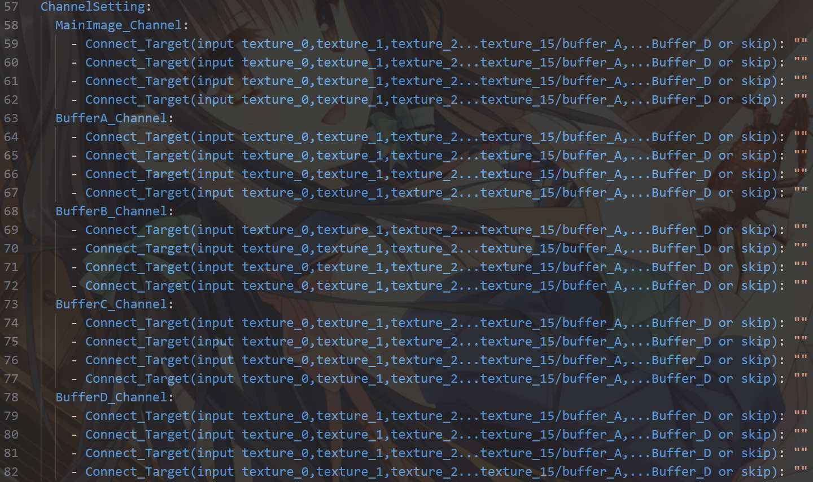  
我挑选MainImage_Channel作为例子示范讲解（其他帧缓冲的原理也是一样的），在MainImage中你会发现有一个容器存储了4个*Connect_Target键值对*，他们是按顺序的，分别对应着Channel0,Channel1,Channel2,Channel3这些将影响帧缓冲的采集对象。数据类型是字符串，不用在意大小写。  
假如我需要加载一张图片，并且想要在MainImage帧缓冲的着色器中的iChannel0使用，我们要像这样子设置，如下图:  
保证texture_1已经加载了贴图，否则链接失败  
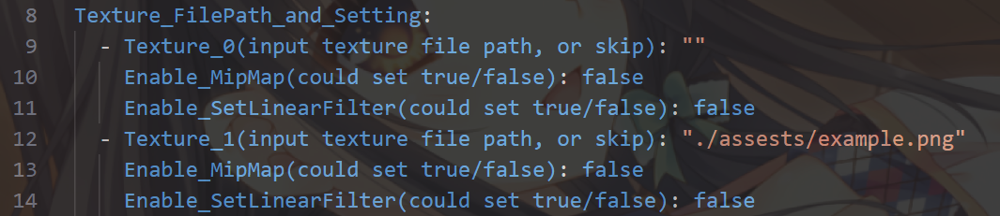  
设置MainImage着色器的iChannel0对象
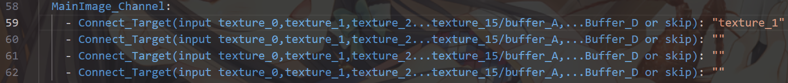  
假如我需要把buffer_a帧缓冲的图像需要挂载到MainImage帧缓冲中的iChannel1，我们就要像这样子设置，如下图:  
保证Buffer_A的着色器已经加载  
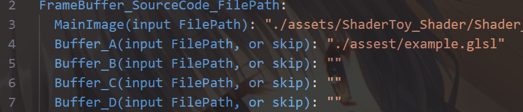  
设置MainImage着色器的iChannel1对象  
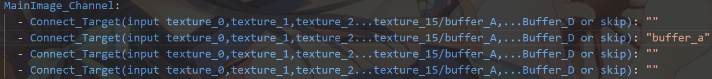  
## GLSL着色器编辑器环境设置，以及源代码前置代码设计
### 编辑环境搭建
1. 推荐使用Microsoft VS Code来编辑着色器文件，建议安装拓展: **Shader language support for VS Code**、**Shader validator**，第一个是glsl代码高亮，第二个是语法检查以及代码补齐。
2. 获取标准片段着色器代码模板的话，在这个文件路径如下: *Ye_ShaderToy/Application/ShaderToy_Shader/Example*，在这个文件夹中你会发现有两个着色器源文件，他们分别是Image.glsl和BufferA.glsl,他们分别是MainImage主图像的模板代码，以及Buffer_x缓冲的模板代码。因此你可以把他们复制出来使用，文件名也可以自定义的，只需要确保在填写配置文件的过程中不要填错路径就行了。
3. 存放你编辑的着色器代码源文件，**不建议移出Ye_ShaderToy这个文件夹**，否则当你想把你制作好的作品在别的电脑上运行时会找不到源文件，**但是你可以在这个文件夹里的任意一个地方存储** 。
### 着色器编辑注意事项
1. 编辑的过程中请不要删除这些内容:  
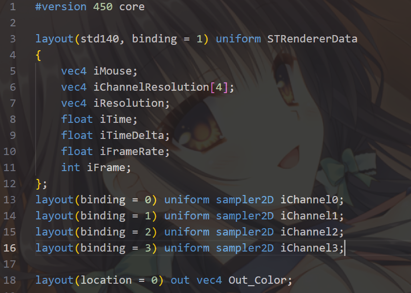
5~16行的内容是cpu端上传的内容，与网页版的ShaderToy的统一变量的内容是*一样*的，而18行的**Out_Color**则是用于负责最终输出的，请不要删除。
2. 开始编辑的位置以及函数的名称和ShaderToy的是一样的如图所示:  
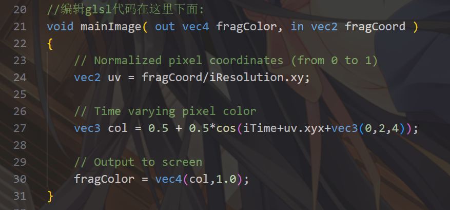
如果我们更改函数的名称可以吗？这当然是可以的，因为**mainImage这个函数并不是着色器的主函数，主函数其实还是main函数**。如果要修改名称的话记得同时去修改主函数调用函数的名称。
3. 在main函数中我们可以简单的调整画面的色调，比如像这样：  
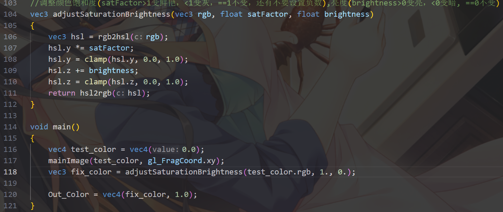
在*mainImage*与*main*函数之间我写了一些比较简单的**色彩调整的函数**，可方便您快速简易的调整整体的画面效果，每个函数都是有注释说明的，如有不清楚的话可以看一眼，**还有这些色彩调整的函数如果您不需要的话可以直接删除的**。
## 调试
### 界面
这个小程序里有一个小小的gui，gui上面会显示帧数，帧延迟，时间，勾选框，以及一个大按钮，如图所示：  
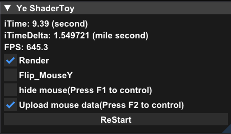  
1. 分别先解释一下选项框，**Render**是控制渲染继续还是暂停，当**取消勾选**画面就会冻住在当前的画面，时间也会暂停，但是如果你的窗口的大小发生了调整，会触发帧缓冲重新构建，导致画面变黑，当你**重新勾选**上，画面就会重新正常并再次渲染，时间继续流动。
2. **Flip_MouseY**是会把你的鼠标输入的坐标的y轴方向上下翻转，同时原点从**标题栏的左下角**移动到**窗口的左下角**，由于鼠标的坐标是在窗口坐标系，渲染的场景的坐标系是右手坐标系，为了方便调试，就允许把鼠标坐标系的正方向和原点位置设置成与渲染场景相同的，但是鼠标坐标值与窗口的分辨率是1：1的，也就是说：*假设窗口大小是1000x800，Flip_MouseY关闭时，鼠标放在窗口标题栏的左下方时，坐标是(0,0)；当鼠标放在窗口的右下方时，坐标是(1000,800)，整体的坐标系如下图:*  
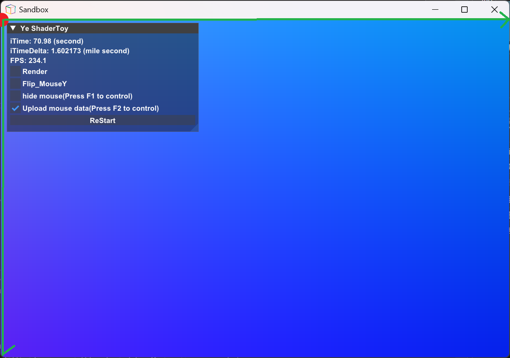
*如果Flip_MouseY打开了，鼠标放在窗口的左下方时，坐标是(0,0),当鼠标放在窗口标题栏的右上方时，坐标是(1000,800)，整体的坐标系如下图:*  
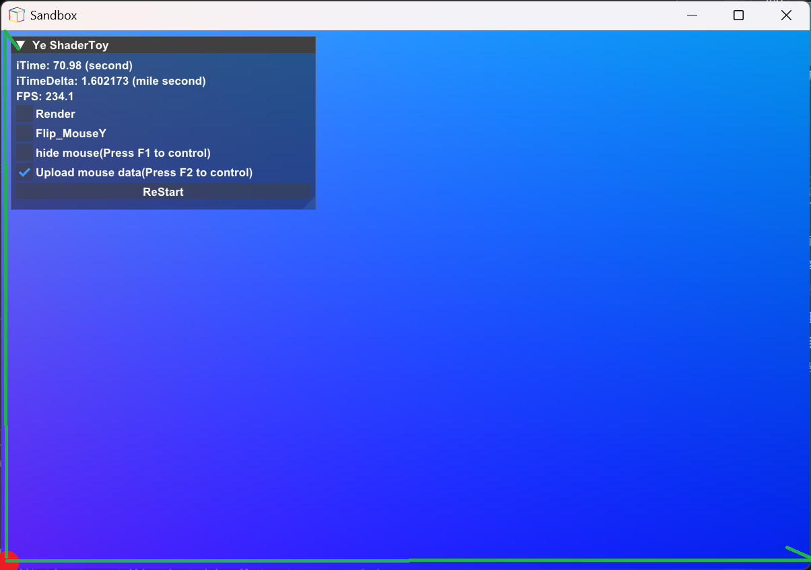
3. **hide mouse**是可以隐藏光标，也支持按下f1快捷键控制
4. **Upload mouse data**是控制是否上传更新当前鼠标的坐标，也支持按下f2快捷键控制，取消勾选，鼠标坐标数据将会保持在最后一次更新。
5. 最后我们来介绍一下最后一个按钮**ReStart**，当我们的Yaml初始化脚本或者是着色器的代码改变了，**程序支持热重载，不需要每次关闭窗口重新启动**。每次重新开始都会终端提示，正常情况下是提示**已重载着色器**，如果你的着色器代码有问题的话，也会在终端中提示，但是程序是不会崩溃的。